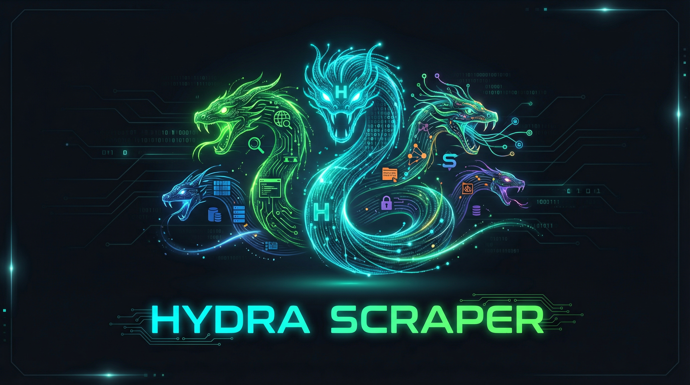

<p align="center">
  
</p>

<h3 align="center">Cut one head off, two more grow back.</h3>

<p align="center">
  Self-healing web scraper with 10 fallback engines.<br/>
  APIs run out of credits. Sites block you. Engines go down.<br/>
  <strong>Hydra doesn't care. Every URL gets scraped, every time.</strong>
</p>

<p align="center">
  
  
  
  
  
</p>

---

## Demo

```
$ hydra-scraper health

  🐍 Hydra Scraper — Engine Health Dashboard
  ────────────────────────────────────────────

  Tier 0 — Free / No Setup

    ✓  jina
    ✓  webfetch

  Tier 1 — Local / Self-Hosted

    ✓  cheerio
    ✓  crawl4ai
    ✓  scrapling
    ✓  playwright

  Tier 2 — Paid API

    ✗  firecrawl — no API key
    ✓  exa
    ✓  tavily
    ✗  browserbase — no API key

  ────────────────────────────────────────────
  8/10 engines active
```

```
$ hydra-scraper "https://example.com"

  ✓ Scraped with jina in 340ms (2,847 chars)
```

---

## Why Hydra?

Every scraper has the same problem: **it works until it doesn't.**

- Jina runs out of free credits mid-sprint
- Firecrawl's API goes down for maintenance
- Instagram blocks your IP after 3 requests
- That SPA renders everything in JavaScript and your HTML parser gets nothing

You're left scrambling to swap engines, rewrite code, and lose momentum.

**Hydra fixes this permanently.** It detects the URL type (Instagram? LinkedIn? PDF? SPA?), picks the best engine chain for that type, and waterfalls through up to 8 engines until one succeeds. No config changes. No code changes. It just works.

---

## Architecture

```
                        ┌─────────────────┐
                        │   hydra-scraper  │
                        │    <url> [opts]  │
                        └────────┬────────┘
                                 │
                    ┌────────────▼────────────┐
                    │    URL Type Detector     │
                    │  instagram? linkedin?    │
                    │  pdf? spa? general?      │
                    └────────────┬────────────┘
                                 │
                    ┌────────────▼────────────┐
                    │   Engine Router          │
                    │   Picks optimal chain    │
                    │   for detected URL type  │
                    └────────────┬────────────┘
                                 │
              ┌──────────────────┼──────────────────┐
              │                  │                   │
     ┌────────▼──────┐ ┌────────▼──────┐  ┌────────▼──────┐
     │   Tier 0      │ │   Tier 1      │  │   Tier 2      │
     │   Free, Zero  │ │   Free, Local │  │   Paid APIs   │
     │   Config      │ │   Install     │  │   (optional)  │
     └───────────────┘ └───────────────┘  └───────────────┘
```

The router tries the **cheapest and fastest engines first**, then escalates to heavier tools only when needed. If an engine returns content that's too short (< 100 chars), Hydra keeps it as a backup but continues trying. You always get the best possible result.

---

## Engines

| Tier | Engine | What It Does | JS Render | Stealth | PDF | Search |
|:----:|--------|-------------|:---------:|:-------:|:---:|:------:|
| 0 | **Jina Reader** | Prefix any URL with `r.jina.ai/` for instant markdown | - | - | - | - |
| 0 | **WebFetch** | Native Node.js fetch + HTML-to-markdown | - | - | - | - |
| 1 | **Cheerio** | Fast HTML parsing, strips junk, converts to clean markdown | - | - | - | - |
| 1 | **Crawl4AI** | Python-based, handles JavaScript-rendered pages | Yes | - | Yes | - |
| 1 | **Scrapling** | Python-based, stealth mode bypasses anti-bot detection | Yes | Yes | - | - |
| 1 | **Playwright** | Full browser automation for auth-walled & JS-heavy pages | Yes | Yes | - | - |
| 2 | **Firecrawl** | Cloud scraping with stealth proxy and PDF support | Yes | Yes | Yes | - |
| 2 | **Tavily** | Content extraction from protected pages | Yes | Yes | - | - |
| 2 | **Exa** | Semantic search + content extraction | - | - | - | Yes |
| 2 | **Browserbase** | Cloud browser sessions for auth-walled pages | Yes | Yes | - | - |

**Tier 0** requires zero setup -- works out of the box.
**Tier 1** requires a local Python venv (optional but recommended).
**Tier 2** requires paid API keys (optional, for maximum coverage).

---

## Quick Start

```bash
# 1. Clone & install
git clone https://github.com/yourusername/hydra-scraper.git
cd hydra-scraper && npm install && npm run build

# 2. Link globally
npm link

# 3. Scrape anything
hydra-scraper "https://example.com"
```

That's it. Tier 0 engines work immediately with zero config.

### Optional: Add Python Engines (Tier 1)

```bash
python3 -m venv .venv
source .venv/bin/activate
pip install crawl4ai scrapling
```

---

## CLI Reference

```bash
# Scrape a URL (auto-detects type, picks best engine chain)
hydra-scraper "https://example.com"

# Check which engines are available
hydra-scraper health

# Force stealth mode (anti-bot evasion for social media)
hydra-scraper --stealth "https://instagram.com/p/xyz"

# Save output to a file
hydra-scraper "https://example.com" -o output.md

# Get JSON output (includes metadata, attempts, timing)
hydra-scraper "https://example.com" --json

# Custom timeout per engine (default: 15000ms)
hydra-scraper "https://example.com" --timeout 30000
```

---

## Configuration

### API Keys (for Tier 2 engines)

Create `~/.hydra.json`:

```json
{
  "firecrawlApiKey": "fc-...",
  "tavilyApiKey": "tvly-...",
  "exaApiKey": "...",
  "browserbaseApiKey": "..."
}
```

Or use environment variables:

```bash
export FIRECRAWL_API_KEY="fc-..."
export TAVILY_API_KEY="tvly-..."
export EXA_API_KEY="..."
export BROWSERBASE_API_KEY="..."
```

### Advanced Options

| Config Key | Env Var | Default | Description |
|-----------|---------|---------|-------------|
| `firecrawlApiKey` | `FIRECRAWL_API_KEY` | - | Firecrawl cloud scraping |
| `tavilyApiKey` | `TAVILY_API_KEY` | - | Tavily content extraction |
| `exaApiKey` | `EXA_API_KEY` | - | Exa semantic search |
| `browserbaseApiKey` | `BROWSERBASE_API_KEY` | - | Browserbase cloud browser |
| `pythonPath` | - | `python3` | Path to Python binary |
| `venvPath` | - | `.venv` | Path to Python venv |
| `defaultTimeout` | - | `15000` | Per-engine timeout (ms) |

---

## URL Type Detection

Hydra automatically detects what kind of URL you're scraping and picks the optimal engine chain:

| URL Pattern | Detected Type | Engine Chain |
|------------|:------------:|-------------|
| `instagram.com/*` | Instagram | Scrapling -> Firecrawl -> Crawl4AI -> Playwright |
| `linkedin.com/*` | LinkedIn | Exa -> Tavily -> Scrapling -> Firecrawl |
| `x.com/*` or `twitter.com/*` | Twitter | Jina -> Firecrawl -> Scrapling -> Tavily |
| `tiktok.com/*` | TikTok | Scrapling -> Firecrawl -> Crawl4AI -> Playwright |
| `*.pdf` | PDF | WebFetch -> Firecrawl -> Crawl4AI |
| Everything else | General | Jina -> WebFetch -> Cheerio -> Crawl4AI -> Scrapling -> Firecrawl -> Playwright |

---

## For Claude Code Users

Hydra ships as a Claude Code skill. Copy it into your skills directory and use it from any session:

```bash
cp -r skill/ ~/.claude/skills/hydra-scraper/
```

Then just say **"scrape this URL"** or use `/scrape` in any conversation. Claude will use Hydra's full engine chain automatically.

---

## Programmatic Usage

```typescript
import { createHydra } from 'hydra-scraper';

const hydra = createHydra();

// Simple scrape
const result = await hydra.scrape('https://example.com');
console.log(result.markdown);   // Clean markdown content
console.log(result.engine);     // Which engine succeeded
console.log(result.attempts);   // Full attempt log with timing

// Stealth mode for social media
const ig = await hydra.scrape('https://instagram.com/p/xyz', {
  stealth: true,
  timeout: 30000,
});
```

---

## Project Structure

```
hydra-scraper/
├── src/
│   ├── cli.ts              # CLI entry point (commander)
│   ├── index.ts             # Public API (createHydra)
│   ├── engine-router.ts     # Brain — URL detection + fallback chains
│   ├── detector.ts          # URL type detection (IG, LinkedIn, PDF, etc.)
│   ├── health.ts            # Engine health dashboard
│   ├── config.ts            # Config loader (~/.hydra.json + env vars)
│   ├── types.ts             # TypeScript interfaces
│   └── engines/
│       ├── jina.ts          # Tier 0 — Jina Reader
│       ├── webfetch.ts      # Tier 0 — Native fetch
│       ├── cheerio.ts       # Tier 1 — HTML parser
│       ├── crawl4ai.ts      # Tier 1 — Python JS renderer
│       ├── scrapling.ts     # Tier 1 — Python stealth
│       ├── playwright.ts    # Tier 1 — Browser automation
│       ├── firecrawl.ts     # Tier 2 — Cloud scraping
│       ├── tavily.ts        # Tier 2 — Content extraction
│       ├── exa.ts           # Tier 2 — Semantic search
│       └── browserbase.ts   # Tier 2 — Cloud browser
├── skill/                   # Claude Code skill integration
├── dist/                    # Compiled JS (git-ignored)
├── package.json
├── tsconfig.json
└── .gitignore
```

---

## Contributing

1. Fork the repo
2. Create a feature branch (`git checkout -b feat/new-engine`)
3. Add your engine in `src/engines/` implementing the `Engine` interface
4. Register it in `src/index.ts`
5. Add it to the appropriate fallback chains in `src/engine-router.ts`
6. Run `npm run build && hydra-scraper health` to verify
7. Open a PR

### Adding a New Engine

Every engine implements this interface:

```typescript
interface Engine {
  name: string;
  tier: 0 | 1 | 2;
  capabilities: Capability[];  // 'html' | 'js-render' | 'stealth' | 'pdf' | 'search' | 'auth'
  isAvailable(): Promise<boolean>;
  scrape(url: string, opts: ScrapeOptions): Promise<ScrapeResult | null>;
}
```

---

## Architecture Audit

**Dave (Systems Architect) says:**
- The 3-tier engine system with per-URL-type fallback chains is clean architecture. Each engine is isolated, stateless, and independently testable -- exactly how you'd want a plugin system.
- The partial-result retention pattern (keeping short content as backup while continuing the chain) is a smart resilience choice. Most scrapers just fail-fast and lose partial data.
- Config loading from both `~/.hydra.json` and env vars means this works in containers, CI, and local dev without code changes. Good 12-factor thinking.
- The `EngineRouter` is the single brain -- URL detection, chain selection, and fallback logic all flow through one class. Easy to reason about, easy to debug.
- **v2 improvement:** Add engine response caching (LRU with TTL). Right now every call to the same URL re-scrapes. A 5-minute cache would cut redundant API calls significantly.
- **v2 improvement:** Add structured logging (not just console.log) so failed attempts can be piped to a monitoring dashboard or log aggregator.

**Alex (Tools Integration) says:**
- The Claude Code skill integration is the killer feature most scrapers don't have. Drop it in `~/.claude/skills/` and every AI coding session gets bulletproof scraping for free.
- Engine isolation is solid -- each engine file is self-contained with its own `isAvailable()` check. Adding a new engine is a 5-minute job: implement the interface, register it, done.
- The health dashboard (`hydra-scraper health`) is a great DX touch. You see exactly what's working before you scrape anything.
- Python engine integration via subprocess (crawl4ai, scrapling) bridges the TS/Python gap without adding Python as a runtime dependency -- you only need it if you want Tier 1 engines.
- **v2 improvement:** Add a `--dry-run` flag that shows which engine chain would be selected for a URL without actually scraping. Useful for debugging and understanding routing.
- **v2 improvement:** MCP server wrapper so Hydra can be used as a tool by any AI agent, not just Claude Code.

---

## License

MIT -- do whatever you want with it.

---

<p align="center">
  <strong>Built by <a href="https://github.com/yourusername">Drey</a></strong><br/>
  <sub>Tools that work. Every time.</sub>
</p>
